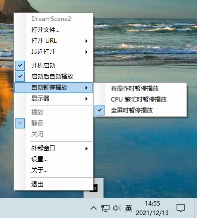

# DreamScene2
**DreamScene2** 是使用 C# 编写的一个小巧快速的 Windows 动态桌面软件。集成了 [WebView2](https://docs.microsoft.com/en-us/microsoft-edge/webview2/) 支持播放网页动画。支持 Windows10/11 系统。

## Features
- 支持视频播放
- 支持 URL 和网页文件
- 支持启动后自动播放
- 支持设置显示器
- 支持自动暂停播放

## Download
下载地址：https://github.com/he55/DreamScene2/releases/latest

## Todo
- [ ] GIF 和 APNG 播放
- [ ] [Live2D](https://www.live2d.com/) 播放
- [ ] 鼠标和桌面交互
- [ ] 屏幕保护程序
- [ ] 更多视频格式
- [ ] 重新设计 UI
- [ ] 本地化
- [ ] 发布到 Microsoft Store

## Thanks
- [Draw Behind Desktop Icons in Windows 8+](https://www.codeproject.com/Articles/856020/Draw-Behind-Desktop-Icons-in-Windows-plus)
- [pinvoke](https://github.com/dotnet/pinvoke)
- [KioskBrowser](https://github.com/mortenbrudvik/KioskBrowser)
